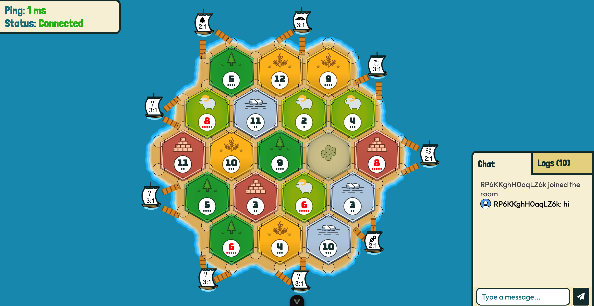

<h1 align="center">
Settlea.org (In Development ~20%)
</h1>

 Settlers of Catan Free Open Source Alternative 

<h3> Progress </h3>

# Description

-   This is the source for [Settlea.org](https://settlea.org) (domain not bought yet), a free and open source alternative to the popular board game Settlers of Catan.
-   This project has no affiliation with, or endorsed by Catan, Klaus Teuber or any of their subsidiaries or affiliates.
-   The client is written in Typescript, PixiJS for the graphics and VUEJS for the rest of the frontend.
-   The server is written in [Go](https://go.dev/) and can be found in the [server](https://github.com/elviscgn/Settlea/tree/main/server) folder.

# Installation

Instructions on how to setup the project locally can be found [here](https://github.com/elviscgn/Settlea/wiki/Installation).

# Roadmap

List of features implemented and planned for the project can be found [here](https://github.com/elviscgn/Settlea/wiki/Roadmap).
